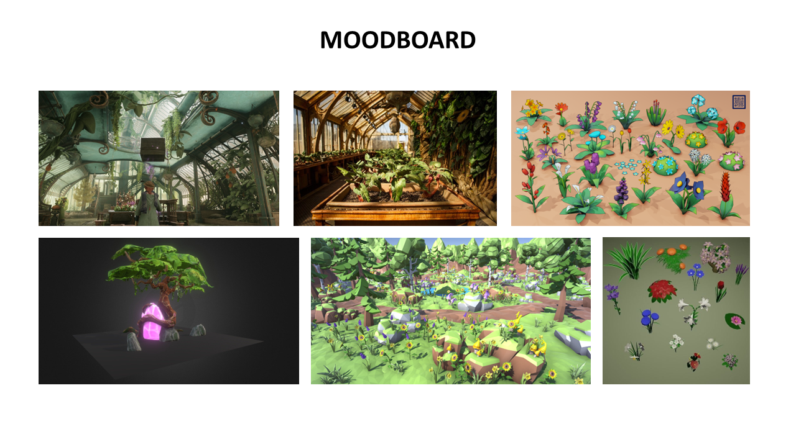
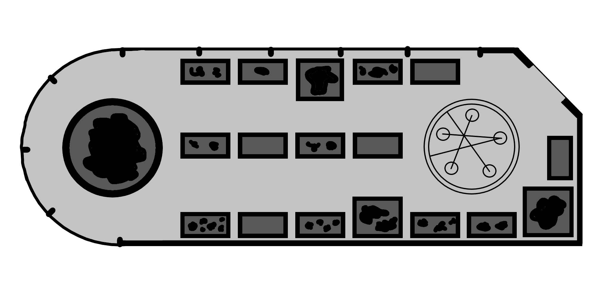
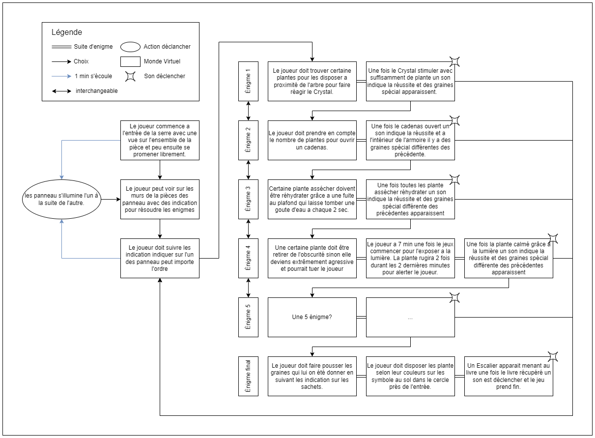

# Plan de projet  
## Résumé  
Un jardin botannique avec des enigmes a résoudre pour trouver un livre de botannique vieux de plus de 2000 ans.  
## Description  
Le joueur incarne un botanniste passionné qui est a la recherche d'un livre de botannique vieux de plus de 2000 ans qui contienderais plusieurs connaissance sur des plantes qui on disparut depuis plusieurs année. La dernière étape de son voyage le mène dans une ancienne cerre de botannique dans la quel plusieurs enigme en rapport avec des plante qu'il na jamais vue avant demande a être résolue si le botanniste veux se montrer digne du savoir du livre.  
## Moodboard  
### Visuel  

### Sonore  
Son/Musique d'embiance :  
https://youtu.be/_UaK5tJLeoc  
Son de crystals :  
https://youtu.be/oxmcxG-jcBU  
## Carte de la map  

## Schéma de programmation/d'interactivité  

